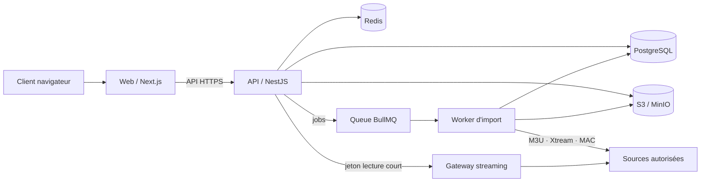

# Vue d’architecture — Mbolo TV

## Responsabilités

1. **API** reçoit les connexions source uniquement via la console propriétaire, valide, chiffre et stocke la connexion, puis publie un job. Elle ne parse jamais une playlist en ligne.
2. **Worker** télécharge avec limites de taille/temps, parse, normalise les catégories, déduplique et produit les entrées de catalogue.
3. **Gateway streaming** (phase 2) résout un flux uniquement après contrôle d’accès et masque l’URL d’origine.
4. **Web** ne manipule que des identifiants de catalogue et des jetons de lecture à durée de vie courte.

## Pipeline d’import

`owner.source.created → source.import.requested → fetch → validate → parse → normalize → deduplicate → upsert catalog → source.ready`

Chaque étape est traçable avec un `importRunId`, réessayable et idempotente.

## Déduplication

Clé primaire métier proposée : `normalized_name + country + category + tvg_id`. En l’absence de `tvg_id`, une empreinte basée sur le nom normalisé et le domaine d’origine est utilisée. Une chaîne conserve plusieurs variantes de diffusion (serveurs) priorisées par santé, résolution et préférence source.

## Sécurité

- SSRF : liste de protocoles, résolution DNS contrôlée, blocage IP privées/métadonnées cloud, redirections limitées.
- Secrets : champ `connectionEncrypted`, chiffrement AES-GCM, rotation des clés, jamais dans logs/erreurs.
- MAC : affichage masqué, chiffrement obligatoire, accès réservé au worker.
- Streaming : allow-list d’hôtes fournisseurs, jetons courts liés à l’utilisateur, limite de débit, audit.
