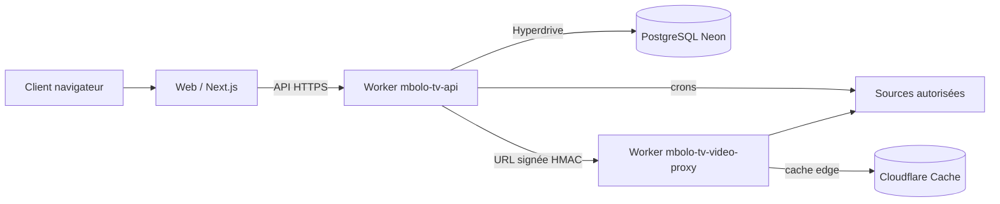

# Vue d’architecture — Mbolo TV

## Responsabilités

1. **Worker API** (`workers/mbolo-tv-api`) : reçoit les connexions source uniquement via la console propriétaire, valide (schémas Zod partagés `@mbolo/contracts`), chiffre (AES-GCM) et stocke la connexion. Les imports tournent dans ses crons (`waitUntil` + triggers `*/2`→`0 5`), pas dans un processus séparé.
2. **Worker vidéo** (`workers/mbolo-tv-video-proxy`) : `GET /video/*?url=…&x-sig=…` résout un flux uniquement après vérification HMAC (anti-relais ouvert), mutualise la lecture par chaîne via Durable Objects (single-flight), met en cache playlists/segments à l’edge, sort en direct pour la VOD.
3. **Web** ne manipule que des identifiants de catalogue et des URLs de lecture signées à durée de vie courte.

## Pipeline d’import

`source.import.requested → fetch (borné taille/temps) → parse (M3U/XMLTV/Xtream) → normalize → deduplicate → upsert catalog → source.ready`

Chaque étape est traçable avec un `importRunId`, réessayable et idempotente.

## Déduplication

Clé primaire métier : `normalized_name + country + category + tvg_id`. En l’absence de `tvg_id`, une empreinte basée sur le nom normalisé et le domaine d’origine est utilisée. Une chaîne conserve plusieurs variantes de diffusion (serveurs) priorisées par santé, résolution et préférence source.

## Sécurité

- SSRF : hosts privés/réservés refusés (`isPrivateHostname`) ; surface limitée aux URLs de sources configurées par l’owner.
- Secrets : champ `connectionEncrypted`, chiffrement AES-GCM (format partagé historique), jamais dans logs/erreurs.
- MAC : affichage masqué, chiffrement obligatoire, résolution serveur uniquement.
- Streaming : URL de lecture signée HMAC avec expiration, réécriture des playlists enfants (chaque URL re-signée), allow-list des hôtes fournisseurs via les extracteurs, plafond éco adaptatif (480p selon affluence) et garde de saturation (429).
